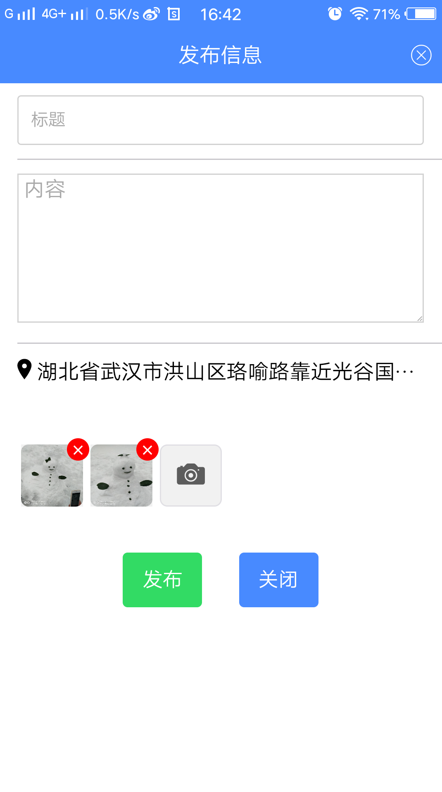

# zhiqingchun
致青春,一个练手的ionic3 App
# 用法
1. git clone https://github.com/leisir2017/zhiqingchun.git
2. cd zhiqingchun
3. npm install //安装
4. ionic cordova platform add android //添加平台
5. 将更目录release-signing.properties这个文件复制到platforms\android文件夹下，用于签名
6. ionic cordova build android --prod --release //压缩签名发布
# dome pic list

