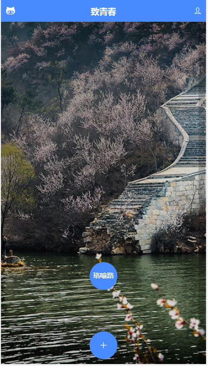
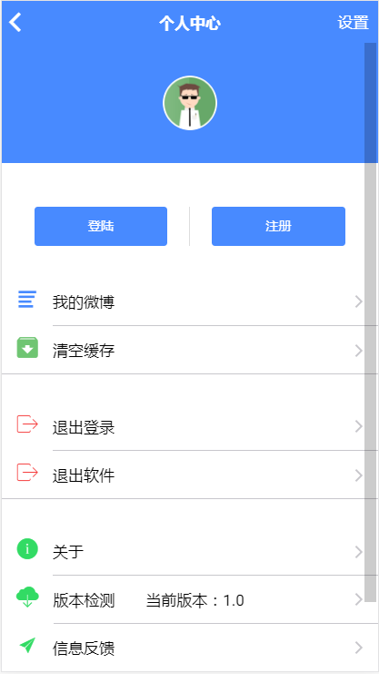
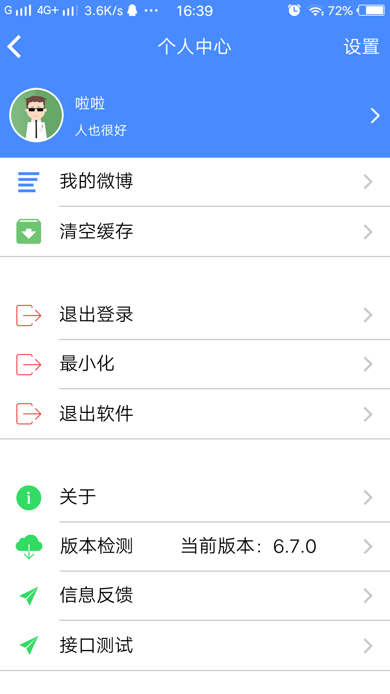

# zhiqingchun
致青春,一个练手的ionic3 App
# 用法
1. git clone https://github.com/leisir2017/zhiqingchun.git
2. cd zhiqingchun
3. npm install //安装
4. ionic cordova platform add android //添加平台
5. 将根目录release-signing.properties这个文件复制到platforms\android文件夹下，用于签名
6. ionic cordova build android --prod --release //压缩签名发布
# 功能
包含相机、相册、扫二维码、定位、http请求封装、欢迎界面、登录、注册、最小化App，退出登录/App、android硬件返回、App更新、内置猫眼接口调用示例、Swiper插件、图片轮播、图片放大/预览等
# dome 部分页面截图

